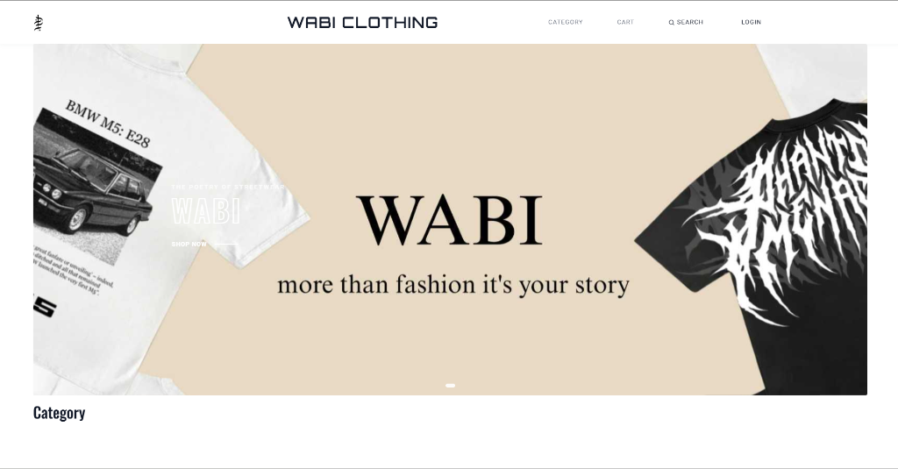

# Wabi Clothing - E-Commerce Platform

[](https://wabiclothing.com/)

A modern, full-featured e-commerce web application built with Django for selling clothing and apparel. Features a complete shopping experience from browsing to checkout with dynamic content management.

[](https://www.djangoproject.com/)
[](https://www.python.org/)

## 🌟 Overview

Wabi Clothing is a production-ready e-commerce MVP designed specifically for fashion brands and clothing retailers. The platform offers seamless product management, intuitive shopping cart functionality, and a powerful CMS for dynamic homepage content control.

## ✨ Key Features

### 🛍️ Shopping Experience
- **Product Catalog**: Browse physical and digital products with rich details
- **Advanced Filtering**: Category-based navigation with featured product highlights
- **Size Management**: Comprehensive size selection with real-time availability tracking
- **Product Reviews**: Customer ratings (1-5 stars) and detailed reviews
- **Smart Cart**: Add items, adjust quantities, and view real-time totals
- **Secure Checkout**: Streamlined checkout flow with shipping address collection

### 📦 Order Management
- **Order Tracking**: Unique order IDs (e.g., `ORD-20240119-A1B2C3`)
- **Status Tracking**: Monitor orders through Pending, Completed, and Cancelled states
- **Transaction IDs**: Complete payment tracking and history
- **Shipping Integration**: Configurable shipping charges and address management

### 👤 Customer Features
- **Account Management**: User registration, login, and profile customization
- **Password Recovery**: Email-based password reset functionality
- **Newsletter Subscription**: Stay updated with latest collections
- **Contact System**: Direct messaging through integrated contact forms

### 🎨 Dynamic Content Management (CMS)
- **Hero Banners**: Customizable homepage banners with images, titles, and CTAs
- **Featured Categories**: Highlight special collections with sortable display
- **Instagram Gallery**: Curated visual feed for social proof and engagement
- **Admin Dashboard**: Enhanced Jazzmin UI for intuitive content control

## 🛠️ Technology Stack

**Backend:**
- Django 5.0.6
- Python 3.x
- SQLite Database
- Custom Email Authentication Backend

**Frontend:**
- HTML5
- CSS3 (Custom Styling)
- JavaScript
- Responsive Design

**Admin Interface:**
- Jazzmin (Enhanced Django Admin UI)

**Additional Features:**
- Time Zone: Asia/Kolkata
- Media Management: Integrated static file handling
- Email System: SMTP configuration for notifications

## 📂 Project Structure

```
wabi-clothing/
├── core/                      # Project configuration
│   ├── settings.py           # Main settings
│   └── urls.py               # Root URL configuration
├── dressapp/                 # Main application
│   ├── models.py            # Database models
│   ├── views.py             # Business logic
│   ├── backends.py          # Custom authentication
│   ├── forms.py             # Form definitions
│   └── urls.py              # App routing
├── templates/               # HTML templates
│   ├── index.html          # Homepage
│   ├── product.html        # Product details
│   ├── cart.html           # Shopping cart
│   └── checkout.html       # Checkout page
├── static/                  # Static assets
│   ├── css/                # Stylesheets
│   ├── js/                 # JavaScript files
│   └── images/             # Media uploads
├── manage.py
└── requirements.txt
```

## 🗄️ Database Schema

### Core Models

**Customer**
- Links to Django User model
- Stores phone number and profile image

**Product**
- Product details (name, price, description)
- Category and featured status
- Size options and availability
- Product images

**SizeOption & ProductSize**
- Flexible size management
- Per-size availability tracking

**Order & OrderItem**
- Complete order lifecycle management
- Item-level details and pricing
- Transaction tracking

**ShippingAddress**
- Delivery information
- Linked to orders

**Review**
- Star ratings (1-5)
- Customer feedback

**CMS Models**
- **Banner**: Homepage hero sections
- **FeaturedCategory**: Highlighted collections
- **InstagramFeed**: Social media gallery

## 🚀 Installation

### Prerequisites
- Python 3.8+
- pip
- Virtual environment (recommended)

### Setup Instructions

1. **Clone the repository:**
```bash
git clone https://github.com/ulageshwaran/wabi-clothing.git
cd wabi-clothing
```

2. **Create and activate virtual environment:**
```bash
python -m venv venv
source venv/bin/activate  # On Windows: venv\Scripts\activate
```

3. **Install dependencies:**
```bash
pip install -r requirements.txt
```

4. **Configure environment variables:**
Create a `.env` file in the root directory:
```env
SECRET_KEY=your_secret_key_here
DEBUG=True
EMAIL_HOST=smtp.gmail.com
EMAIL_PORT=587
EMAIL_HOST_USER=your_email@gmail.com
EMAIL_HOST_PASSWORD=your_app_password
```

5. **Run migrations:**
```bash
python manage.py makemigrations
python manage.py migrate
```

6. **Create superuser:**
```bash
python manage.py createsuperuser
```

7. **Collect static files:**
```bash
python manage.py collectstatic
```

8. **Start development server:**
```bash
python manage.py runserver
```

Visit `http://127.0.0.1:8000/` to view the application.

## 🔐 Admin Panel

Access the enhanced Jazzmin admin interface at `/admin/`

**Features:**
- Product management
- Order processing
- Customer management
- Dynamic content control (banners, featured categories)
- Review moderation

## 📸 Screenshots

*Add screenshots of your application here*

## 🎯 Key Features Breakdown

### For Customers
✅ Browse product catalog with filters  
✅ Add items to cart with size selection  
✅ Secure checkout process  
✅ Track order status  
✅ Write product reviews  
✅ Manage account and shipping addresses  

### For Administrators
✅ Full product CRUD operations  
✅ Order management and tracking  
✅ Dynamic homepage customization  
✅ Customer data management  
✅ Review moderation  
✅ Analytics and reporting  

## 🔒 Security Features

- Custom email-based authentication
- CSRF protection
- Secure password hashing
- Session management
- SQL injection prevention (Django ORM)

## 📈 Future Enhancements

- [ ] Payment gateway integration (Stripe, PayPal, Razorpay)
- [ ] Wishlist functionality
- [ ] Advanced search and filters
- [ ] Email notifications (order confirmation, shipping updates)
- [ ] Product recommendations
- [ ] Multi-currency support
- [ ] Inventory alerts
- [ ] Analytics dashboard
- [ ] Mobile app integration

## 🤝 Contributing

Contributions are welcome! Please feel free to submit a Pull Request.

1. Fork the repository
2. Create your feature branch (`git checkout -b feature/AmazingFeature`)
3. Commit your changes (`git commit -m 'Add some AmazingFeature'`)
4. Push to the branch (`git push origin feature/AmazingFeature`)
5. Open a Pull Request

## 📝 License

This project is licensed under the MIT License - see the [LICENSE](LICENSE) file for details.

## 👥 Team

Built with ❤️ by passionate developers

## 📧 Contact

Website:

[www.wabiclothing.com](https://wabiclothing.com)

## 🙏 Acknowledgments

- Django Documentation
- Jazzmin Admin Theme
- Bootstrap Framework
- The open-source community

---

<div align="center">

**⭐ Star this repository if you find it helpful!**

Made with 💙 using Django

</div>